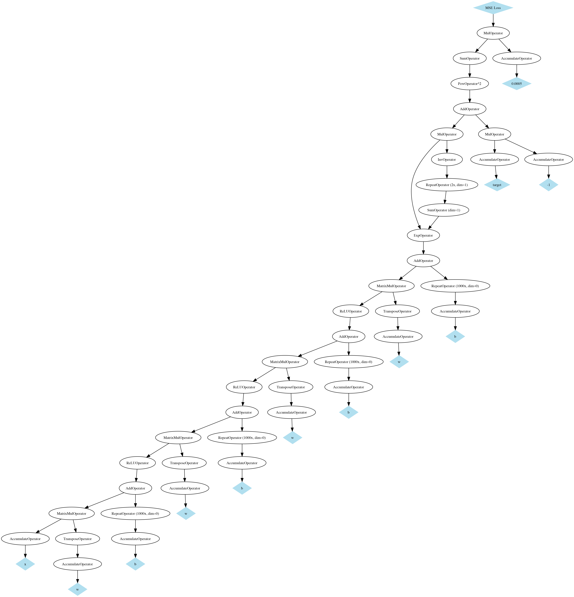

# Autogradlib: A simple Python library for automatic differentiation

## Usage

The folder `example` implements a simple neural network containing 3 hidden layers that is built dynamically and trained on the fly using the autograd mechanism. Run `python -m example.run` to try it out.

Defining a model is as straightforward as using PyTorch.

```python
model = Sequential(
      Linear(2, 25), ReLU(),
      Linear(25, 25), ReLU(),
      Linear(25, 25), ReLU(),
      Linear(25, 2), Softmax(dim=1)
  )
  
l = LossMSE(model(train_input), train_target)
```

Backpropagation is handled automatically by autogradlib. Thus, training the network simply requires to reinitialize the accumulated gradients and to subtract the gradients to each parameter of the model:

```python
# Backprop
model.zero_grad()
loss.backward()

for param in model.params():
    param.tensor -= eta * param.grad
```

The code additionally produces the following computational graph:



This can be done using the following code:

```python
dot = l.draw_graph()
dot.render("plots/model.gv", view=True)
```
